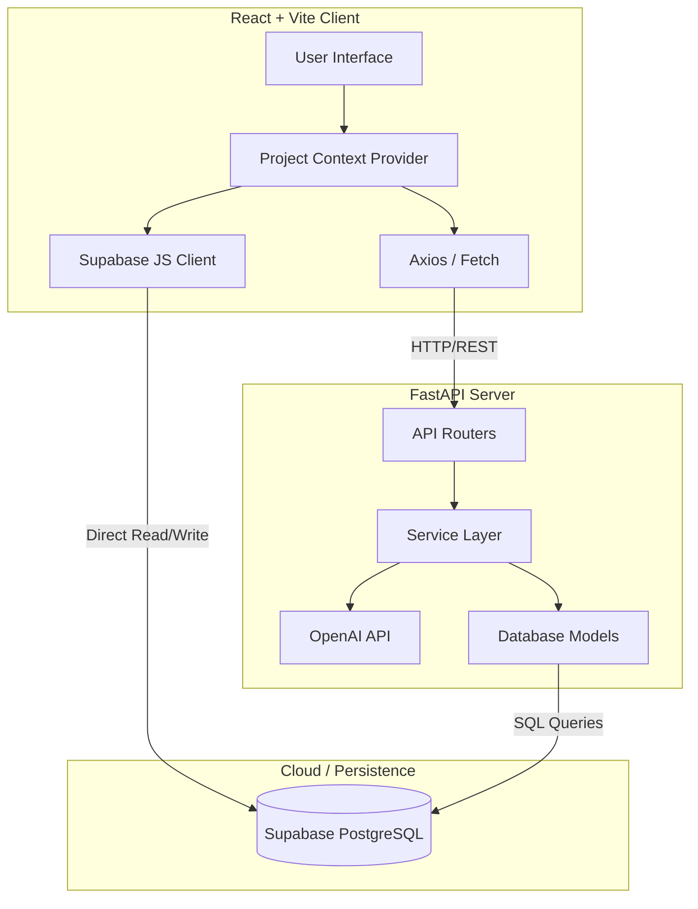
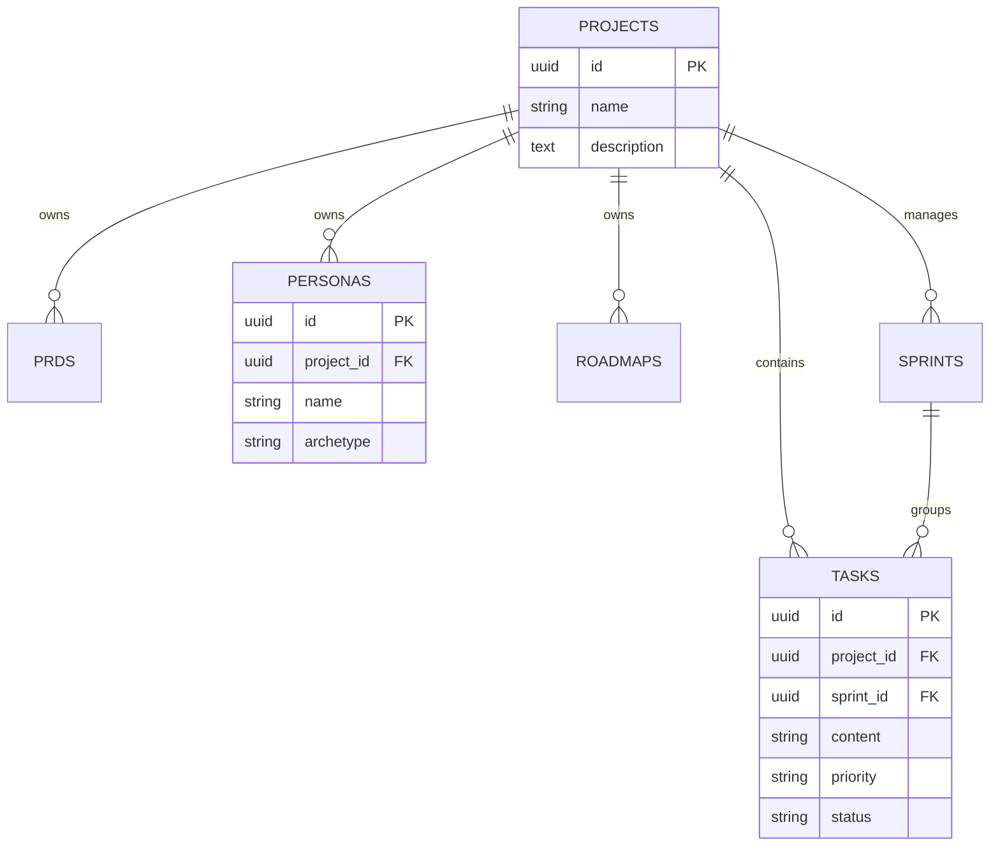

# ProductPilot: System Architecture & Product Documentation

## 1. Executive Summary & Product Vision
**ProductPilot** is an advanced, AI-driven product management workspace designed to accelerate the product discovery and planning phases. By leveraging Large Language Models (LLMs), ProductPilot transforms raw product ideas into comprehensive, structured artifacts including Product Requirements Documents (PRDs), User Personas, Strategic Roadmaps, and Agile Backlogs. 

The core philosophy revolves around **System Thinking in Product Design**: treating the product not as a static document, but as a dynamic ecosystem of interconnected entities (Epics → Personas → Milestones → Tasks). The platform isolates these entities within dedicated **Workspaces**, enabling multi-product portfolio management from a single application.

---

## 2. System Architecture
The application employs a decoupled client-server architecture, communicating via RESTful APIs, with a cloud-native PostgreSQL database handling persistent state.

---

## 3. Frontend Implementation
The frontend is built using **React** and **Vite**, focusing on a premium, glassmorphic dark-mode aesthetic with fluid micro-animations.

**Key Design Patterns:**
*   **Context API for State Management:** The `ProjectContext` acts as the single source of truth, maintaining the `activeProject`. All views (Backlog, Roadmap, Personas) automatically re-render and fetch scoped data when the active project changes.
*   **Progressive Generation (Idea Wizard):** A multi-step state machine that guides the user through generating the product. Instead of executing one massive blocking API call, the Wizard breaks generation into manageable, reviewable chunks (Idea → PRD → Personas → Roadmap → Backlog).
*   **Optimistic UI & Drag-and-Drop:** The `Backlog.jsx` component implements `@hello-pangea/dnd` for fluid task management. State updates locally instantly during a drag event, followed by asynchronous syncs to Supabase.

---

## 4. Backend Logic & Logic Layer
The backend is a high-performance **FastAPI** application designed with strict separation of concerns.

**Core Layers:**
1.  **Routers (`/routers`)**: Defines HTTP endpoints and input validation using Pydantic schemas. 
2.  **Services (`/services`)**: Contains the core business logic. The `ai.py` service handles the complex orchestration of OpenAI prompts, ensuring outputs strictly conform to required JSON schemas for predictable parsing.
3.  **Authentication**: Employs JWT (JSON Web Tokens) and Google OAuth flows for secure endpoint access.

**System Thinking in AI Generation:**
The platform rejects the concept of isolated data models. Instead, it enforces **Relational Product Design**. The AI service maintains a strict logical chain:
1.  **Ideation**: Raw concept generates a structured PRD.
2.  **User-Centric Shift**: The PRD context is fed forward into Persona generation to ensure the features match actual target demographics.
3.  **Temporal Planning**: Personas and Epics are combined to build a Strategic Roadmap (Milestones).
4.  **Agile Execution**: Milestones are broken down into a Backlog of discrete, scorable Tasks.

This guarantees semantic consistency across the entire workspace, making the AI act as an integrated product team rather than a simple text generator.

---

## 5. Database Design (Supabase PostgreSQL)
The database is structured relationally, enforcing data isolation at the project level. Every artifact generated by the AI is strictly bound to a `project_id`.

---

## 6. Admin Dashboard Overview
The system features a dedicated `/admin` route for platform operators. 
*   **Purpose:** To monitor platform health, usage metrics, and AI cost optimizations.
*   **Capabilities:** 
    *   System-wide execution metrics (Total Workspaces, Generated Artifacts).
    *   AI Token Usage estimation (Planned).
    *   System health toggles and user management overviews.
*   **Architecture:** Built entirely on standalone queries that bypass the `ProjectContext`, allowing a macroscopic view of the database.

---

## 7. Git Commit Progression
The actual development lifecycle of ProductPilot can be traced through the repository's git history, reflecting an evolutionary build-up from documentation to full AI orchestration.

| Commit Hash | Date | Commit Message |
| :--- | :--- | :--- |
| **b3d34ab** | 2026-06-07 | chore: make Replit ready and sync dashboard |
| **f47afc1** | 2026-06-07 | Complete Phase 3 UI updates and Phase 4 Admin/Auth integration |
| **6bb171f** | 2026-06-07 | Implement interactive multi-step IdeaWizard connected to AI endpoints |
| **bb742ec** | 2026-06-07 | Implement Smart Logic Engine for deterministic priority and risk scoring |
| **2954cda** | 2026-06-07 | Inject 78KB product_pilot_system_prompt into AI Orchestrator API calls |
| **e8679e3** | 2026-06-07 | Implement Human-in-the-Loop step-by-step AI orchestration and persistence |
| **06abbf1** | 2026-06-07 | Implement AI Orchestrator service with robust exponential backoff |
| **af11ebc** | 2026-06-07 | Implement SQLAlchemy models and Pydantic schemas for the DAL |
| **4567274** | 2026-06-07 | Scaffold Python FastAPI backend, database, and env configurations |
| **5362b51** | 2026-06-07 | Merge branch 'feature/auth' |
| **c6493d4** | 2026-06-07 | Complete frontend views: Admin Dashboard, Backlog DND, Roadmap Matrix, Layouts |
| **1c58f8a** | 2026-06-07 | Use env variables for frontend auth |
| **0653bd0** | 2026-06-07 | Add Auth pages with Google OAuth integration |
| **3732f0a** | 2026-06-07 | Scaffold React frontend and build Idea Wizard UI |
| **1451cbb** | 2026-06-07 | Merge pull request #1 from akhilbharadwaj326/Product_planning |
| **1cd8a9f** | 2026-06-07 | Rename IdeaForge to ProductPilot and add .gitignore |
| **2cfaaf8** | 2026-06-07 | Add UI Design Plan, SAD, Implementation Plan, and update PRD |
| **40026c5** | 2026-06-07 | Add Product Planning documents: PRD, BRD, and Architecture Plan |
| **bb2c747** | 2026-06-07 | Initial commit |

---

## 8. Next Steps & Future Scale
As ProductPilot scales, the architectural foundation supports several key upgrades:
1.  **Row Level Security (RLS)**: Enforcing user-specific constraints directly at the database level in Supabase.
2.  **WebSocket Integration**: Allowing multiple team members to collaboratively edit PRDs or drag-and-drop tasks in the Backlog simultaneously.
3.  **AI Caching**: Implementing Redis or an in-memory cache to skip redundant LLM generations for similar product queries, optimizing API costs.
